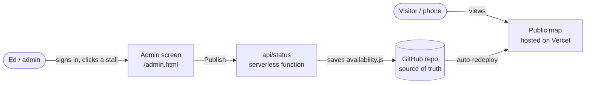

# Trio Garage Map — Handover & Ownership Guide

This document explains, in plain terms, **what the system is, how the pieces fit together,
who owns what, and how to move everything under Drivn's control** so any developer can run it
in the future.

---

## 1. What it is

- **Public map** — the interactive garage map anyone can view and share
  (`https://trio-garage-map.vercel.app/`, or your own web address).
- **Admin screen** — a private, password-protected page (`/admin.html`) where you click a
  stall to set **Available / Reserved / Unavailable**, then press **Publish**.
- When you publish, the public map updates on its own within about a minute.

It's built with plain, standard web technology (HTML, CSS, JavaScript) and one small
serverless function — no unusual frameworks, no database to run. Any web developer can
maintain it.

---

## 2. How the pieces fit together

- **GitHub** holds all the code and data (the "source of truth").
- **Vercel** hosts the website and runs the small save-function. Every time GitHub changes,
  Vercel rebuilds the site automatically.
- The **admin secrets** (password + a GitHub access token) are stored **only in Vercel's
  settings**, never in the code.

---

## 3. What each file is

| Path | What it is |
|------|------------|
| `index.html` | The public map page |
| `admin.html` | The private admin page |
| `assets/app.js` | Public map behaviour |
| `assets/admin.js` | Admin screen behaviour |
| `assets/data.js` | Stall content — photos & descriptions (**editable**) |
| `assets/availability.js` | Which stalls are available / unavailable (**editable**; also written by the admin screen) |
| `assets/styles.css`, `assets/admin.css` | Look & feel |
| `assets/logo.png`, `assets/disabled.png` | Drivn logo, wheelchair icon |
| `photos/` | Stall photos (`stall-01.jpg` …) |
| `garage-map.svg` | The editable vector map (for changing the drawing in Illustrator) |
| `api/status.js` | The serverless function that saves admin changes to GitHub |
| `README.md` | How to make everyday content changes |
| `ADMIN-SETUP.md` | The admin's two settings (password + token) |
| `HANDOVER.md` | This document |

---

## 4. Everyday updates (no developer needed)

- **Availability:** use the admin screen (`/admin.html`). See `ADMIN-SETUP.md`.
- **Photos / descriptions:** edit `assets/data.js` (instructions in `README.md`), or ask any
  developer.

---

## 5. Putting everything under Drivn's control

Goal: the code, the website, and the settings all live in **Drivn-owned accounts**, so Drivn
controls it permanently and can hand it to any developer. Do these once.

> Recommendation: create the accounts using a **Drivn company email** (e.g.
> `admin@drivnparking.com`) so ownership never depends on any one person. Add your developer
> as a collaborator rather than making them the owner.

**A. GitHub (holds the code)**
1. Create a GitHub account/organization for Drivn (Drivn email).
2. Move the project in. Either:
   - **Transfer:** current owner opens the repo → *Settings → General → Transfer ownership* →
     transfer to the Drivn account; **or**
   - **Fresh copy:** create an empty repo under Drivn, then a developer pushes the code into it.
3. (Optional) Add your developer as a collaborator with write access.

**B. Vercel (hosts the website)**
1. Create a Vercel account for Drivn (sign in with the Drivn GitHub from step A).
2. *Add New → Project → Import* the Drivn repo. Framework preset **Other**, no build command.
3. Add two environment variables (see `ADMIN-SETUP.md`): `ADMIN_PASSWORD` and `GITHUB_TOKEN`.
   The function auto-detects which repo it's deployed from, so no owner/repo settings are
   needed when it's on Vercel.
4. Deploy. You'll get a `…vercel.app` address immediately.

**C. Admin access token (under Drivn)**
- Create a new GitHub fine-grained token **from the Drivn GitHub account** (Contents: Read and
  write on the Drivn repo) and put it in Drivn's Vercel `GITHUB_TOKEN`. Delete the old token.

**D. Custom web address (optional)**
- If Drivn owns `drivnparking.com`: in Vercel → *Project → Settings → Domains*, add
  `map.drivnparking.com`, then add the DNS record Vercel shows you at your domain provider.
- The public map is then at `https://map.drivnparking.com/` and the admin at
  `https://map.drivnparking.com/admin.html`.

**E. Finish**
- Test the public map and the admin (sign in, flip a stall, Publish, confirm it updates).
- Once Drivn's version is confirmed working, the old hosting can be retired.

After this, **Drivn owns the code (GitHub), the hosting (Vercel), and the settings** — nothing
depends on any individual.

---

## 6. For a future developer

- **Stack:** static HTML/CSS/JS + one Vercel serverless function (`api/status.js`, Node). No
  build step, no database.
- **Run locally:** open `index.html` in a browser. `admin.html` opens in a read-only offline
  preview (publishing only works on the live site).
- **Source of truth:** everything is in the GitHub repo. Vercel auto-deploys `main`.
- **Change the map drawing / add a location:** the map geometry comes from a traced SVG; the
  process for building a new property's map is documented separately (Milestone 6 —
  "Reusable for future locations").
- **Secrets:** only in Vercel's environment variables — never in the repo.

---

## 7. Credentials checklist

| Secret | Where it lives | Notes |
|--------|----------------|-------|
| Admin password | Vercel env var `ADMIN_PASSWORD` | Change anytime in Vercel |
| GitHub token | Vercel env var `GITHUB_TOKEN` | Reissue under Drivn during handover; rotate if ever exposed |

Never commit these to the repo or paste them into shared documents. If a secret is ever
exposed, revoke it and create a new one — no code changes are needed.
